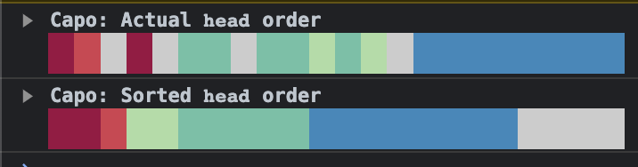
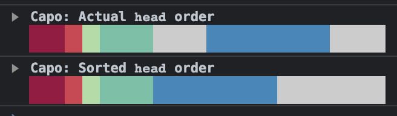

# next-optimized-head

Next.js `<Head/>` which orders elements to improve (perceived) page performance.

## Status

Inspired by [capo.js](https://github.com/rviscomi/capo.js) and [ct.css](https://csswizardry.com/ct/), this first version is only a few hours old and is missing a lot of common elements, check back in a few weeks.

## Installation

```
npm install --save next-optimized-head
```

## Usage

Use in place of `Head` from `next/document` in your `_document.tsx`.

```jsx
import { Html, Main, NextScript } from 'next/document';
import { Head } from 'next-optimized-head';

export default function Document() {
  return (
    <Html lang="en">
      <Head />
      <body>
        <Main />
        <NextScript />
      </body>
    </Html>
  );
}
```

## Example

When run against [create-next-app](https://nextjs.org/docs/pages/api-reference/create-next-app)

### Before



### After



The exact sorted order which [capo.js](https://github.com/rviscomi/capo.js) recommends is not possible due to next.js inserting a `<noscript>` element which must be present before one of its scripts is loaded afterwards.
